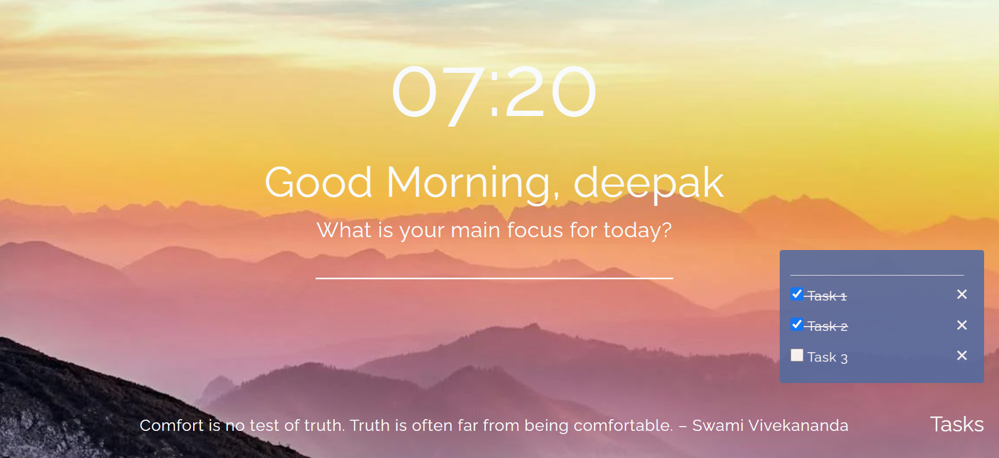

# Greet Ext

Greet Ext is a browser extension that greets you with a message according to the time of the day and shows a different background on page refresh. It also allows you to set your main/focus task of the day and create your own todo list.

## Features

- **Dynamic Greetings**: Receive personalized greetings based on the time of the day.
- **Background Themes**: Enjoy a refreshing background theme on every page refresh.
- **Main/Focus Task**: Set your main/focus task of the day to stay focused and organized.
- **Todo List**: Create and manage your todo list directly from the extension.

## Screenshots

